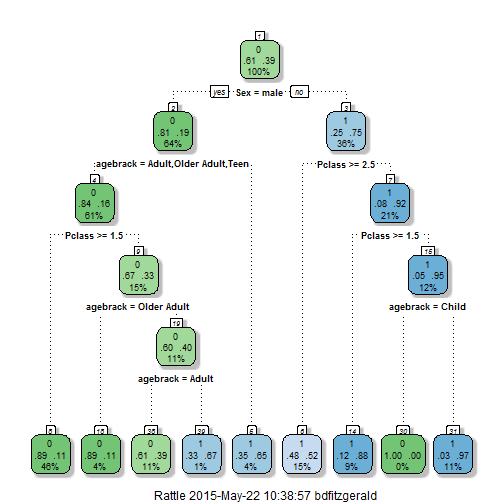

## Data Processing and Clean Up


-Data was obtained from kaggle.com's Titantic: Machine Learning from Disaster  
-Training data was loaded and partitioned into 60% for training and 40% crossvalid data set  
-Data clean up began

```r
set.seed(2015)
train <- read.csv("C:/Users/bdfitzgerald/Desktop/Data Science Specialist/Developing Data Products/train.csv")
intrain <- createDataPartition(train$Survived, p = 0.60, list = FALSE)
train <- train[intrain,]; crossvalid <- train[-intrain,]
```

```r
colnames(train)
```

 [1] "PassengerId" "Survived"    "Pclass"      "Name"        "Sex"        
 [6] "Age"         "SibSp"       "Parch"       "Ticket"      "Fare"       
[11] "Cabin"       "Embarked"   

--- .class #id 

## Survival and Perish Rates


-Survival Rates by Sex

|   | female|  male|
|:--|------:|-----:|
|0  |  0.251| 0.808|
|1  |  0.749| 0.192|
-Survival Rates by Age Bracket

|   | Adult| Child| Older Adult| Teen|
|:--|-----:|-----:|-----------:|----:|
|0  | 0.623| 0.368|       0.698| 0.61|
|1  | 0.377| 0.632|       0.302| 0.39|
-Survival Rates by Ticket Class

|   |     1|     2|     3|
|:--|-----:|-----:|-----:|
|0  | 0.394| 0.514| 0.752|
|1  | 0.606| 0.486| 0.248|

--- .class #id 

## Model Algorithm
-A simple basic decision tree was generated using the Age Brackets, Sex, and Ticket Class


--- .class #id 

## Data Product

Using the algorithm, a data product was produced so an individual could find out if he or she would survive or perish if they were on the boat.   

http://barriefitzgerald.shinyapps.io/titantic_survival_prediction/


